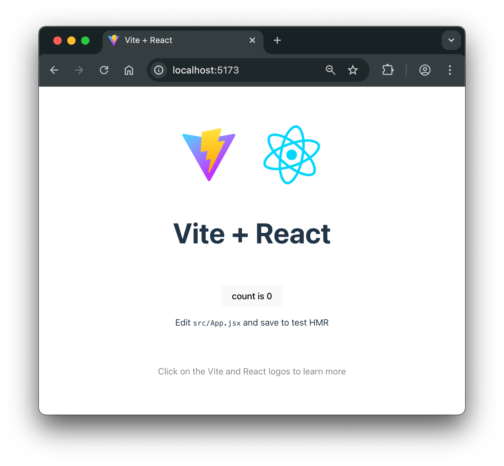

# Crear una app de React con Vite

## En una frase

Vite es una herramienta de construcción que crea la estructura de un proyecto React, ofrece un servidor de desarrollo con recarga instantánea y genera los archivos optimizados para producción.

-----

## Antes de empezar

Necesitas:

* **Node.js** instalado. Vite exige Node.js 20.19+ o 22.12+ (algunas plantillas pueden pedir una versión mayor). Compruébalo con `node -v`.
* **npm**, que se instala junto con Node.js.
* Una **terminal** y un **editor de código**.

Conviene que ya sepas qué es un componente: [Tu primer componente](../02-componentes-y-props/01-Your%20First%20React%20Component.md).

Palabras nuevas (más términos en el [Glosario](Glosario.md)):

* **Bundler:** herramienta que toma muchos archivos de código (y sus dependencias) y los combina y optimiza para el navegador.
* **Servidor de desarrollo (dev server):** servidor local que sirve la app mientras la programas.
* **HMR (Hot Module Replacement):** actualización de solo los módulos modificados en el navegador, sin recargar la página completa.
* **Scaffolding:** generar la estructura inicial de un proyecto a partir de una plantilla.
* **SPA (Single Page Application):** app que carga una sola página HTML y actualiza la interfaz con JavaScript.

-----

## El problema

Se puede usar React con un HTML y etiquetas `<script>`, pero no escala:

1. El navegador no entiende JSX ni TypeScript. Hay que transformarlos a JavaScript.
2. Cada dependencia (`react`, `react-dom`, otras) tendría que cargarse a mano y en el orden correcto.
3. Para producción se necesita minificar, dividir el código y manejar archivos como CSS e imágenes.
4. Sin servidor de desarrollo, cada cambio exige recargar el navegador y se pierde el estado de la pantalla.

Un bundler o herramienta de construcción resuelve todo esto. **Vite** (se pronuncia "vit", del francés "rápido") lo hace con dos piezas:

* Un **servidor de desarrollo** con HMR muy rápido.
* Un **comando de build** que empaqueta el código para producción.

React ya no recomienda Create React App (ver más abajo). Para apps nuevas, su documentación recomienda un framework; Vite es una alternativa válida cuando quieres una SPA o una configuración propia.

-----

## Cómo funciona

### 1. Crear el proyecto

```bash
npm create vite@latest
```

`npm create` ejecuta el paquete `create-vite` sin instalarlo globalmente. Vite pregunta:

1. **Nombre del proyecto** (por ejemplo, `my-react-app`).
2. **Framework:** elige **React**.
3. **Variante:** elige **TypeScript** (la plantilla `react-ts`).

Las preguntas exactas pueden variar entre versiones de `create-vite`. También puedes indicar todo en el comando:

```bash
npm create vite@latest my-react-app -- --template react-ts
```

Con otros gestores: `yarn create vite` o `pnpm create vite`.

### 2. Instalar dependencias

```bash
cd my-react-app
npm install
```

`npm install` lee `package.json` y descarga las dependencias en `node_modules/`.

### 3. Estructura de carpetas

La estructura exacta cambia entre versiones de la plantilla, pero incluye estos elementos:

```
my-react-app/
├── public/           archivos estáticos que se copian tal cual
├── src/
│   ├── assets/       imágenes y otros recursos procesados por Vite
│   ├── App.tsx       componente principal
│   ├── main.tsx      punto de entrada de la app
│   └── (estilos .css)
├── index.html        entrada del proyecto
├── package.json      dependencias y scripts
├── tsconfig.json     configuración de TypeScript (raíz)
├── tsconfig.app.json configuración para el código de src/
├── tsconfig.node.json configuración para archivos de herramientas
├── vite.config.ts    configuración de Vite
└── .gitignore
```

* **`index.html`:** en Vite es la **entrada** del proyecto y está en la raíz, no dentro de `public/`. Contiene un `<div id="root">` y una etiqueta `<script type="module" src="/src/main.tsx">`. Vite procesa ese HTML y sigue los `import` desde ese script.
* **`src/main.tsx`:** crea la raíz de React con `createRoot(...)` y renderiza `<App />` dentro del `<div id="root">`.
* **`src/App.tsx`:** componente principal. Aquí empiezas a programar.
* **`public/`:** archivos que se sirven sin procesar (por ejemplo, el favicon).
* **`vite.config.ts`:** configuración de Vite. La plantilla incluye el plugin de React. Aquí se agregan alias, proxy para APIs u otros plugins.
* **`node_modules/`:** dependencias instaladas. No se sube a Git.

### 4. Scripts de `package.json`

Los scripts de la plantilla `react-ts` son:

```json
{
  "dev": "vite",
  "build": "tsc -b && vite build",
  "lint": "...",
  "preview": "vite preview"
}
```

* **`npm run dev`:** inicia el servidor de desarrollo.
* **`npm run build`:** comprueba los tipos con `tsc -b` y genera la versión de producción en `dist/`.
* **`npm run preview`:** sirve localmente el contenido de `dist/` para probarlo. No es un servidor de producción.
* **`npm run lint`:** ejecuta el linter que trae la plantilla (ESLint en versiones anteriores; la plantilla actual usa otro linter). El comando exacto depende de la versión.

### 5. Iniciar el servidor de desarrollo

```bash
npm run dev
```

Por defecto Vite sirve la app en `http://localhost:5173/`. Abre esa dirección en el navegador y verás la página inicial de la plantilla:



Deja la terminal abierta: el servidor corre mientras esté activa.

### 6. HMR: ver cambios al guardar

Abre `src/App.tsx` y reemplaza su contenido por:

```tsx
function App() {
  return <h1>Hola, React</h1>;
}

export default App;
```

Al guardar, el navegador se actualiza solo. Vite reemplaza únicamente el módulo modificado (HMR), sin recargar toda la página. Con los componentes de React, la integración de "fast refresh" intenta conservar el estado local cuando es posible.

-----

## Ejemplo completo

Secuencia de comandos desde cero:

```bash
node -v                                                   # v20.19+ o v22.12+
npm create vite@latest my-react-app -- --template react-ts
cd my-react-app
npm install
npm run dev
```

Resultado esperado en la terminal (los números de versión cambian):

```
  VITE vX.Y.Z  ready in NNN ms

  ➜  Local:   http://localhost:5173/
  ➜  Network: use --host to expose
```

Resultado esperado en el navegador tras editar `App.tsx` como arriba: una página con el encabezado

```
Hola, React
```

Para producir la versión final:

```bash
npm run build     # genera la carpeta dist/
npm run preview   # sirve dist/ localmente para probar
```

-----

## Errores comunes

### 1. Versión de Node.js antigua

**Qué pasa:** `npm create vite@latest` o `npm run dev` falla con un error de versión o de sintaxis.
**Por qué:** Vite requiere Node.js 20.19+ o 22.12+.
**Solución:** actualiza Node.js (con el instalador oficial o un gestor de versiones como nvm) y confirma con `node -v`.

### 2. Puerto ocupado

**Qué pasa:** el servidor arranca en otro puerto (por ejemplo, 5174) o falla.
**Por qué:** otro proceso, quizá otra instancia de Vite, usa el 5173. Por defecto, Vite prueba el siguiente puerto libre, salvo que fijes `--strictPort`.
**Solución:** lee la URL que imprime la terminal, cierra el proceso anterior o elige un puerto: `npm run dev -- --port 3000`.

### 3. Ejecutar `npm run dev` fuera de la carpeta del proyecto

**Qué pasa:** error `Missing script: "dev"` o `ENOENT` por no encontrar `package.json`.
**Por qué:** npm busca `package.json` en la carpeta actual.
**Solución:** entra a la carpeta del proyecto con `cd my-react-app` y vuelve a ejecutar.

### 4. Olvidar `npm install`

**Qué pasa:** `vite` no se reconoce como comando o no se encuentran módulos.
**Por qué:** sin `npm install` no existe `node_modules/`, que contiene Vite y React.
**Solución:** ejecuta `npm install` dentro del proyecto. Hazlo también después de clonar un repositorio.

-----

## En TypeScript

La plantilla `react-ts` ya trae TypeScript configurado. Sus archivos `.tsx` admiten JSX con tipos.

* **`tsconfig.json`:** archivo raíz que referencia a los otros dos.
* **`tsconfig.app.json`:** opciones para el código de la aplicación (`src/`), que corre en el navegador: JSX, librerías del DOM, reglas estrictas.
* **`tsconfig.node.json`:** opciones para archivos que corren en Node.js, como `vite.config.ts`.

Se separan porque el código del navegador y el de las herramientas tienen entornos distintos (el primero necesita tipos del DOM; el segundo, tipos de Node).

Vite solo **transpila** TypeScript y no comprueba tipos durante `dev`. Los tipos se verifican con `tsc -b`, que el script `build` ejecuta antes de empaquetar, y con el editor. Más detalles: [Archivo tsconfig](../00-typescript-fundamentals/02-Archivo%20tsconfig.md).

-----

## Cuándo sí y cuándo no

| Necesidad | Opción habitual |
| --- | --- |
| SPA, dashboard interno, prototipo, app detrás de un login | **Vite + React** |
| SEO, renderizado en servidor (SSR), rutas y datos integrados, Server Components | **Framework** como Next.js o React Router |
| App móvil | Expo (React Native) |

* **Vite** te da un cliente rápido y configuración mínima, pero routing, obtención de datos y despliegue los eliges tú. Renderizar en servidor requeriría montarlo por tu cuenta.
* **Un framework** resuelve routing, división de código, obtención de datos y SSR de forma integrada. React lo recomienda para apps nuevas. A cambio, aprendes sus convenciones.

Regla práctica: si necesitas SSR o SEO, o quieres una solución integral, parte de un framework. Si es una SPA sin esos requisitos, Vite es suficiente.

-----

## Resumen en 5 líneas

1. Vite es una herramienta de construcción con servidor de desarrollo rápido y build de producción.
2. Se crea el proyecto con `npm create vite@latest`, eligiendo React y TypeScript (`react-ts`).
3. Después: `cd` al proyecto, `npm install` y `npm run dev` (`http://localhost:5173/`).
4. `index.html` es la entrada; `main.tsx` monta `<App />`; `package.json` define `dev`, `build`, `preview` y `lint`.
5. Vite sirve una SPA; si necesitas SSR o SEO, considera un framework como Next.js.

-----

## Para profundizar

<details>
<summary>Variables de entorno</summary>

Vite expone variables mediante `import.meta.env`. Solo las que empiezan con `VITE_` llegan al código del cliente:

```
# .env
VITE_API_URL=https://api.ejemplo.com
```

```tsx
const url = import.meta.env.VITE_API_URL;
```

Estos valores quedan **incluidos en el código que descarga el navegador**. No pongas claves secretas en variables `VITE_`. Archivos como `.env.local` se ignoran en Git. Los valores se leen al iniciar `dev` o al hacer `build`; si los cambias, reinicia el servidor.

</details>

<details>
<summary>Por qué Vite es rápido</summary>

En desarrollo, Vite sirve el código como **módulos ES nativos**: el navegador pide cada módulo y Vite lo transforma bajo demanda, sin empaquetar toda la app al inicio. Las dependencias de `node_modules` se preempaquetan una vez (con esbuild) porque cambian poco. Para producción, Vite empaqueta con Rollup o con Rolldown (su sucesor en Rust, según la versión), porque cargar cientos de módulos sueltos sería lento.

</details>

<details>
<summary>Create React App (CRA)</summary>

El equipo de React anunció la deprecación de Create React App el 14 de febrero de 2025: no tiene mantenedores activos. Queda en modo mantenimiento. La documentación de React recomienda frameworks (Next.js, React Router, Expo) y, para casos particulares, herramientas como Vite, Parcel o Rsbuild.

</details>

-----

## En entrevista

### Respuesta corta (junior)

Vite es una herramienta de construcción para proyectos frontend. Con `npm create vite@latest` creo un proyecto React con TypeScript, instalo dependencias con `npm install` y arranco el servidor de desarrollo con `npm run dev`. Ofrece recarga rápida al guardar cambios y `npm run build` para generar la versión de producción.

### Respuesta ampliada (semi-senior)

* **Velocidad en desarrollo:** sirve módulos ES nativos bajo demanda y preempaqueta dependencias con esbuild, así que el arranque no depende del tamaño de la app.
* **HMR:** reemplaza solo los módulos cambiados; con el plugin de React, el fast refresh conserva el estado de los componentes cuando es posible.
* **Producción:** empaqueta con Rollup o Rolldown, con tree shaking, minificación y división de código (code splitting), por ejemplo con `import()` dinámico.
* **Entrada:** `index.html` en la raíz es el punto de partida; Vite sigue el `<script type="module">`.
* **Variables de entorno:** solo las `VITE_*` se exponen en `import.meta.env` y quedan visibles en el bundle, por lo que no sirven para secretos.
* **TypeScript:** Vite transpila sin verificar tipos; el chequeo lo hace `tsc -b` en `build`.
* **Límite:** es un bundler, no un framework. No trae SSR, routing ni obtención de datos integrados.

### Preguntas frecuentes de seguimiento

**1. ¿Vite o Create React App?**
CRA está deprecado desde febrero de 2025 y solo recibe mantenimiento. Para apps nuevas, React recomienda un framework, y Vite es la alternativa habitual cuando se quiere una SPA.

**2. ¿Qué es HMR?**
Es la actualización de solo los módulos modificados en el navegador, sin recargar la página completa. Acelera el ciclo de desarrollo y, con React, suele conservar el estado local.

**3. ¿Diferencia entre `dev` y `build`?**
`dev` levanta un servidor con módulos sin empaquetar y HMR, pensado para programar. `build` genera archivos estáticos optimizados en `dist/`, listos para desplegar. `preview` solo sirve esa carpeta localmente.

**4. ¿Qué hace `index.html` como entrada?**
Vite parte de ese HTML, sigue el script `main.tsx` y todos sus `import`. A diferencia de otros bundlers, el HTML es parte del grafo de módulos, no un archivo aparte.

**5. ¿Cómo uso variables de entorno?**
Se definen en `.env` con prefijo `VITE_` y se leen con `import.meta.env.VITE_NOMBRE`. Son públicas: se incrustan en el bundle en tiempo de build.

**6. ¿Cuándo elegir Next.js en vez de Vite?**
Cuando necesito SSR o generación estática, SEO, routing y obtención de datos integrados, o Server Components. Para una SPA sin esos requisitos, Vite es más simple.

-----

## Siguiente lección

Con la app funcionando, el siguiente paso es aprender a inspeccionar sus componentes: [React Developer Tools](02-React%20Developer%20Tools.md).
