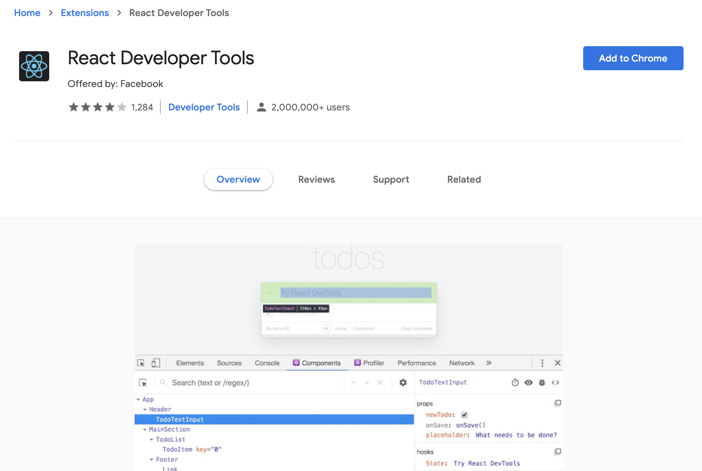
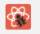
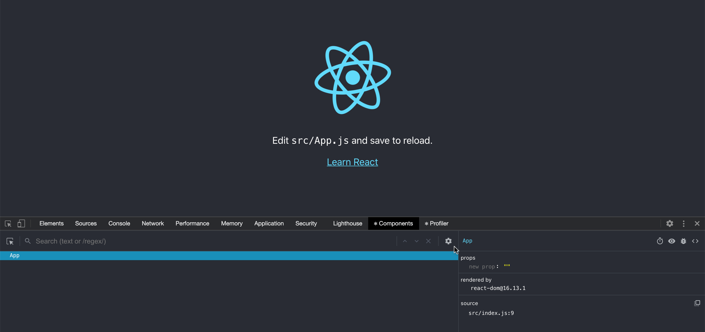
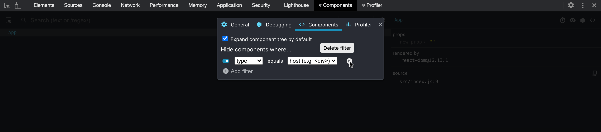
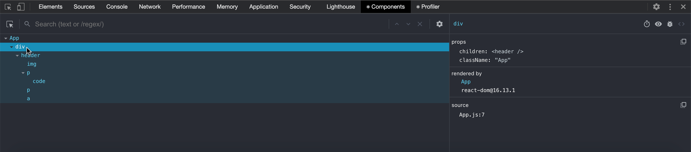
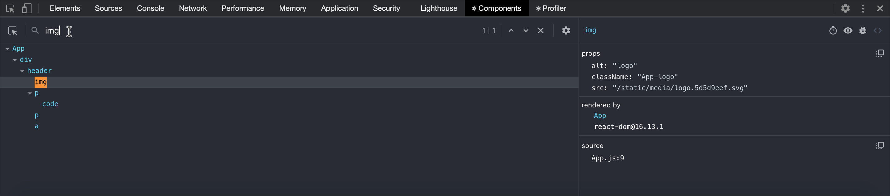
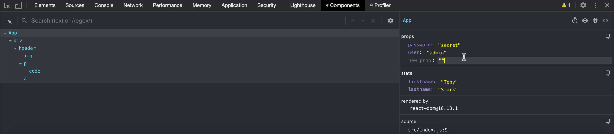
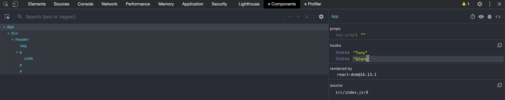
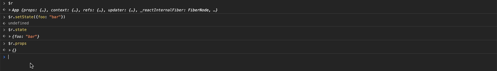

# React Developer Tools

## En una frase

React Developer Tools es una extensión del navegador que agrega a las herramientas de desarrollo dos pestañas, **Components** y **Profiler**, para inspeccionar el árbol de componentes de React, ver y editar sus props, estado y Hooks, y medir su rendimiento.

-----

## Antes de empezar

Conviene que ya sepas:

* Qué es un componente y cómo recibe props: [Tu primer componente](../02-componentes-y-props/01-Your%20First%20React%20Component.md).
* Qué es el estado y cómo lo guarda `useState`: [useState](../04-hooks-y-context/01-The%20State%20Hook.md).
* Abrir las herramientas de desarrollo del navegador (Chrome DevTools o equivalentes).

Palabras nuevas (también en el [Glosario](Glosario.md)):

* **Árbol de componentes:** jerarquía de componentes de React que forman la aplicación, con `App` como raíz.
* **Nodo del host:** elemento del DOM real (`div`, `button`...), a diferencia de un componente de React.
* **Build de desarrollo / de producción:** el desarrollo incluye advertencias e información de depuración; el de producción está optimizado y no las incluye.

-----

## El problema

El inspector del navegador (pestaña Elements) muestra el **DOM**: `div`, `button`, atributos. No muestra lo que importa al depurar React:

* Qué **componente** produjo cada elemento.
* Qué **props** recibió y qué **estado** tiene.
* Qué valores guardan sus **Hooks**.

Para averiguarlo solo con el inspector tendrías que llenar el código de `console.log`. React Developer Tools expone esa información directamente.

-----

## Cómo funciona

### Instalación

La extensión oficial está disponible para **Chrome, Firefox y Edge**. Se instala desde la tienda de extensiones de cada navegador; los enlaces están en la [documentación oficial](https://react.dev/learn/react-developer-tools).



Para Safari y otros entornos existe el paquete independiente `react-devtools` (`npm install -g react-devtools`), que se abre en una ventana aparte y se conecta a la página.

### Estado del ícono

Al visitar un sitio, el ícono de la extensión indica qué detectó:

* **Inactivo:** la página no usa React.


* **Activo, desarrollo:** la página usa React en modo de desarrollo.



* **Activo, producción:** la página usa el build de producción de React. Se ve distinto al de desarrollo.


### Pestañas Components y Profiler

Abre las herramientas de desarrollo del navegador. Junto a Elements, Console o Sources aparecen dos pestañas nuevas, **Components** y **Profiler**. Solo se muestran en páginas con React. Si no las ves, expande la lista de pestañas con la flecha `>>`.



* **Components:** inspecciona y edita el árbol de componentes.
* **Profiler:** registra renders para medir cuánto tardan y por qué ocurrieron.

### Inspeccionar el árbol y filtrar

En Components, el panel izquierdo muestra el árbol. Al pasar el cursor sobre un componente, la extensión resalta en la página lo que renderiza. Al hacer clic, el panel derecho muestra sus datos.

La extensión puede ocultar algunos nodos del árbol mediante filtros. Su configuración está en el ícono de engranaje, en la sección **Components**, aunque la ubicación y los nombres exactos dependen de la versión.





Si el panel está en vertical (DevTools acoplado a un lado), el árbol queda arriba y los datos debajo.

### Buscar

La barra de búsqueda filtra el árbol por nombre de componente.



### Ver y editar props, estado y Hooks

Con un componente seleccionado, el panel derecho lista sus **props**, su **state** y sus **Hooks**. Puedes editar valores directamente para probar cómo reacciona la interfaz. Los cambios no modifican tu código: al recargar la página se pierde el efecto.



Con componentes de función, los valores de `useState` y otros Hooks aparecen en la sección **hooks**.



### `$r` en la consola

En Chrome, al seleccionar un componente en DevTools, este queda accesible en la consola como `$r`, y puedes inspeccionar sus props, estado y propiedades de instancia. Por ejemplo, `console.log($r)`.



### Opciones útiles

En el engranaje de las herramientas hay ajustes que conviene conocer:

* **Resaltar actualizaciones:** según la versión, los ajustes incluyen una opción para resaltar los componentes cuando se renderizan, útil para ver qué se vuelve a renderizar tras una acción. Búscala en la configuración de la extensión.
* **Filtros de componentes:** permiten ocultar nodos del árbol.
* **Profiler:** la grabación de renders se controla desde su propia pestaña.

La documentación oficial no detalla estas opciones, y sus nombres y ubicación pueden cambiar entre versiones.

-----

## Ejemplo completo

Una tarjeta con un contador y una prop:

```jsx
function LikeButton({ label }) {
  const [likes, setLikes] = useState(0);

  return (
    <button onClick={() => setLikes(likes + 1)}>
      {label}: {likes}
    </button>
  );
}
```

Flujo de depuración:

1. Abre la aplicación en desarrollo y las herramientas de desarrollo. Ve a **Components**.
2. Escribe `LikeButton` en la búsqueda y selecciónalo en el árbol. La página resalta el botón.
3. En el panel derecho, revisa la prop `label` y, en **hooks**, el valor de `State`, que es `0`.
4. Edita el valor del estado a `10`. El botón muestra `10` sin haber hecho clic.
5. Haz clic en el botón. Ahora muestra `11`: el estado editado es el punto de partida real del componente.
6. En la consola, `console.log($r)` muestra el componente seleccionado.

Resultado: verificaste que el componente reacciona al estado sin modificar el código ni recargar.

-----

## Errores comunes

| Qué pasa | Por qué | Cómo se arregla |
| --- | --- | --- |
| No aparecen las pestañas Components y Profiler | La página no usa React, o las pestañas están ocultas por falta de espacio | Revisa el ícono de la extensión. Expande la lista de pestañas con `>>` |
| Solo aparece `App` o faltan elementos | Es posible que los filtros del árbol oculten algunos nodos | Revisa los filtros en la configuración de Components |
| El sitio muestra el ícono de producción | Usa el build de producción, sin información de depuración completa | Depura con el build de desarrollo local. Un sitio ajeno en producción se puede inspeccionar, pero con menos información |
| La extensión no funciona en ese sitio | Puede estar deshabilitada o sin acceso a ese sitio. Si abres la página como `file://` en Chrome, falta activar "Allow access to file URLs" | Revisa la configuración de la extensión en el navegador |
| Algunos componentes aparecen sin nombre o como `Anonymous` | Suele deberse a funciones anónimas, por ejemplo `export default () => ...` | Dales un nombre: `function Card() {...}` |
| Los cambios editados desaparecen | Son solo de la sesión actual | Aplica el cambio en el código |

-----

## Cuándo sí y cuándo no

Úsala cuando:

* Necesitas saber qué props o estado recibió un componente.
* Quieres probar un valor de estado sin escribir código.
* Investigas por qué algo se renderiza más veces de lo esperado.

No la uses como sustituto de:

* Pruebas automáticas: editar valores a mano no queda registrado.
* Las herramientas nativas del navegador para red, CSS o errores de JavaScript.

-----

## Resumen en 5 líneas

1. React Developer Tools agrega las pestañas Components y Profiler a las herramientas del navegador.
2. Existe para Chrome, Firefox y Edge; para otros entornos hay un paquete independiente.
3. El ícono indica si la página no usa React, o si usa el build de desarrollo o de producción.
4. Components permite ver y editar props, estado y Hooks; `$r` expone el componente seleccionado en la consola.
5. Los cambios son temporales: sirven para experimentar, no para persistir.

-----

## Para profundizar

<details>
<summary>Profiler</summary>

La pestaña Profiler graba renders y muestra cuánto tardó cada componente. Se explica en [React Profiler](../09-performance/01-React%20Profiler.md).

</details>

<details>
<summary>React Native y otros entornos</summary>

Para React Native 0.76 o superior se usa **React Native DevTools**, el depurador integrado. Para versiones anteriores y para Safari se usa el paquete independiente `react-devtools`. Detalles en la [documentación oficial](https://react.dev/learn/react-developer-tools).

</details>

-----

## En entrevista

### Respuesta corta (junior)

React Developer Tools es una extensión del navegador que agrega las pestañas Components y Profiler. Permite ver el árbol de componentes, sus props, estado y Hooks, y editarlos en vivo para depurar.

### Respuesta ampliada (semi-senior)

La pestaña Components muestra el árbol de React, no el DOM: cada componente con sus props, estado y Hooks, que se pueden editar para reproducir casos sin tocar el código. En Chrome, `$r` da acceso en la consola al componente seleccionado. La pestaña Profiler graba renders para encontrar cuellos de botella. La extensión funciona mejor con el build de desarrollo, que conserva más información; el ícono indica en qué modo está la página.

### Preguntas frecuentes de seguimiento

* **¿En qué se diferencia del inspector Elements?** Elements muestra el DOM; Components muestra componentes de React con sus props y estado.
* **¿Qué es `$r`?** Una variable de la consola que apunta al componente seleccionado en la pestaña Components.
* **¿Los cambios editados persisten?** No. Se pierden al recargar; hay que aplicarlos en el código.
* **¿Sirve en producción?** Detecta el build de producción y lo indica con el ícono, pero ofrece menos información que en desarrollo.
* **¿Qué haces si no aparecen las pestañas?** Verifico que la página use React, que la extensión esté activa para el sitio y que las pestañas no estén ocultas en `>>`.
* **¿Cómo depuras en Safari o React Native?** Con el paquete independiente `react-devtools`, o con React Native DevTools desde la versión 0.76.

-----

## Siguiente lección

Continúa con la carpeta [Hooks y Context](../04-hooks-y-context/README.md).
